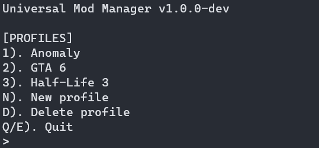

<dev class="heading">
    <h1 align="center">Universal Mod Manager (UMM)</h1>
    
A basic text-based <i>Mod Manager</i>, all it does is replace the existing gamefiles with the modified ones. 
    this will also backup original gamefiles, and restore them when you close the game.

    
</dev>

# How to Use

1. execute the `main.py` script.  
2. create a new profile.  
3. put your mods inside the profile's mods directory.  
4. select your created profile, and the game you selected will launch.  
